<p align="center">
  
</p>

<p align="center">
  <a href="https://github.com/harshjsh01">
    
  </a>
  <a href="https://github.com/harshjsh01">
    
  </a>
  <a href="https://github.com/harshjsh01">
    
  </a>
</p>

<p align="center">
  <a href="https://linkedin.com/in/harshjsh01" target="_blank">
    
  </a>
  <a href="https://twitter.com/harshjsh01" target="_blank">
    
  </a>
  <a href="mailto:harshjoshi.dev@gmail.com">
    
  </a>
  <a href="https://github.com/harshjsh01?tab=repositories">
    
  </a>
</p>

---

## ⚡ Executive Summary & Identity

```yaml
Name: Harsh Joshi
Alias: Shadow Architect // Deep-Tech Founder
Domain: Autonomous AI Systems, Embedded & 5G Hardware, High-Concurrency Web & WebAR
Institution: Engineering College Bikaner (GEC Bikaner) — B.Tech in CSE (2023 – Present)
Research Fellow: Summer Research Intern @ Indian Institute of Technology Ropar (IIT Ropar)
Campus Roles: Technical Coordinator (SAC) & Technical Lead (E-Cell)
Cadet & Athlete: Senior Under Officer (SUO) in NCC | All-India 8th Rank (National Karate)
Flagship Event: Lead Organizer & Student Coordinator — Aahvaan 2025
Core Philosophy: "Synthesizing deep-silicon hardware architectures with generative neural intelligence."
```

* Creative AI Engineer, Founder, and Systems Thinker building at the intersection of **custom hardware**, **enterprise-grade generative AI**, and **immersive spatial web experiences**.
* Proven track record across deep-tech research at **IIT Ropar** (industrial optimization algorithms), large-scale student leadership across **GEC Bikaner's SAC and E-Cell**, and disciplined athletic excellence.

---

## 📊 Live Telemetry & GitHub Analytics

<div align="center">
  <table border="0" cellspacing="0" cellpadding="0" style="border: none; background: transparent;">
    <tr align="center">
      <td>
        
      </td>
      <td>
        
      </td>
    </tr>
    <tr align="center">
      <td colspan="2">
        <br/>
        
      </td>
    </tr>
  </table>
</div>

---

## 🧪 The Startup Ecosystem

An agile ecosystem spanning hardware innovations, augmented reality commerce, AI client engineering, and circular ecological sustainability:

<table>
  <thead>
    <tr style="background-color: #060e24; border-bottom: 2px solid #00f5d4;">
      <th align="left" width="22%" style="color: #00f5d4;">Venture &amp; Focus</th>
      <th align="left" width="48%" style="color: #00ff87;">Core Initiatives &amp; Architecture</th>
      <th align="left" width="30%" style="color: #38bdf8;">Production Tech Stack</th>
    </tr>
  </thead>
  <tbody>
    <tr>
      <td valign="top">
        <b>⚡ Zenfine</b><br/>
        <sub><code>DEEP-TECH &amp; AI LAB</code></sub><br/><br/>
        <i>Next-gen embedded hardware &amp; enterprise AI financial orchestration.</i>
      </td>
      <td valign="top">
        <ul>
          <li><b>4G-to-5G Connectivity Modem:</b> High-throughput cross-platform hardware bridge enabling instant 5G cellular communication onto legacy industrial and compute nodes.</li>
          <li><b>"Dev Steno" Keyboard:</b> Ergonomic, custom-machined mechanical stenography keyboard engineered for ultra-low latency, chorded developer input.</li>
          <li><b>Zenfine Costing Engine:</b> Enterprise AI CFO suite with LangChain-driven RAG querying, automated balance sheet analytics, and real-time ledger forecasting.</li>
        </ul>
      </td>
      <td valign="top">
        <code>Python</code> <code>FastAPI</code><br/>
        <code>Pandas</code> <code>LangChain</code><br/>
        <code>RAG Vector DB</code> <code>React</code><br/>
        <code>Electron</code> <code>Custom PCB/C++</code>
      </td>
    </tr>
    <tr>
      <td valign="top">
        <b>🌐 Y-dix</b><br/>
        <sub><code>AR LIFESTYLE BRAND</code></sub><br/><br/>
        <i>Bridging physical streetwear with WebAR interactive 3D digital layers.</i>
      </td>
      <td valign="top">
        <ul>
          <li>Spatial web merchandise viewer with zero-app-install target tracking.</li>
          <li>Frictionless checkout engine powered by a zero-fee Dynamic UPI payment gateway.</li>
          <li>60 FPS interactive 3D mesh rendering optimized for mobile browser runtimes.</li>
        </ul>
      </td>
      <td valign="top">
        <code>Next.js 15</code> <code>TypeScript</code><br/>
        <code>Three.js</code> <code>Mind-AR</code><br/>
        <code>Tailwind CSS</code> <code>Framer Motion</code><br/>
        <code>Dynamic UPI Gateway</code>
      </td>
    </tr>
    <tr>
      <td valign="top">
        <b>🎨 Navra Studio</b><br/>
        <sub><code>CREATIVE &amp; AI INTEGRATION</code></sub><br/><br/>
        <i>Full-stack digital agency &amp; generative AI integration consultancy.</i>
      </td>
      <td valign="top">
        <ul>
          <li>Enterprise brand identity synthesis, multi-track motion graphics &amp; video production.</li>
          <li>Custom fine-tuned LLM workflows and computer vision pipelines for corporate clients.</li>
          <li>Automated social content generation pipelines and creative media suites.</li>
        </ul>
      </td>
      <td valign="top">
        <code>Custom AI Pipelines</code><br/>
        <code>OpenAI API</code> <code>DaVinci Resolve</code><br/>
        <code>Premiere Pro</code> <code>Figma</code><br/>
        <code>Automation Scripts</code>
      </td>
    </tr>
    <tr>
      <td valign="top">
        <b>🌱 Sustainable Gaushala</b><br/>
        <sub><code>CIRCULAR BIO-IMPACT</code></sub><br/><br/>
        <i>Self-sustaining ecological sanctuary model located in the outskirts of Jaipur.</i>
      </td>
      <td valign="top">
        <ul>
          <li>Closed-loop organic ecosystem utilizing industrial vermicomposting beds.</li>
          <li>Bio-gas energy generation infrastructure converting organic waste into autonomous power.</li>
          <li>Eliminates external supply chain dependencies through circular agriculture.</li>
        </ul>
      </td>
      <td valign="top">
        <code>Circular Bio-Economy</code><br/>
        <code>Vermicompost Automation</code><br/>
        <code>Bio-Gas Energy Systems</code><br/>
        <code>Ecological Modeling</code>
      </td>
    </tr>
  </tbody>
</table>

---

## 🛠️ Featured Engineering Repositories

<table>
  <tr>
    <td width="50%" valign="top">
      <table width="100%" style="background-color: #030712; border: 1px solid #00f5d444; border-radius: 8px;">
        <tr>
          <td>
            <h3 style="color: #00f5d4; margin: 0;">🚆 AI Railway Twin</h3>
            <sub><b>B.Tech Research Thesis // Decision-Support Simulation</b></sub>
            <p>High-fidelity dispatching simulation engine built to optimize train track routing, simulate conflict resolution, and eliminate delay saturations across complex Indian Railways corridors.</p>
            <p>
              
              
              
              
            </p>
          </td>
        </tr>
      </table>
    </td>
    <td width="50%" valign="top">
      <table width="100%" style="background-color: #030712; border: 1px solid #00ff8744; border-radius: 8px;">
        <tr>
          <td>
            <h3 style="color: #00ff87; margin: 0;">🛡️ Shadow Monarch Firewall</h3>
            <sub><b>Intelligent AI Notification Interceptor</b></sub>
            <p>Autonomous Android notification firewall capturing live payloads via <code>NotificationListenerService</code>, executing instant Hinglish intent classification with Google Gemini 1.5 Flash on FastAPI.</p>
            <p>
              
              
              
              
            </p>
          </td>
        </tr>
      </table>
    </td>
  </tr>
  <tr>
    <td width="50%" valign="top">
      <table width="100%" style="background-color: #030712; border: 1px solid #38bdf844; border-radius: 8px;">
        <tr>
          <td>
            <h3 style="color: #38bdf8; margin: 0;">📞 AI Call Assistant</h3>
            <sub><b>Autonomous Receptionist &amp; Spam Scrambler</b></sub>
            <p>Voice-enabled AI receptionist for Android that intercepts unknown callers, synthesizes real-time speech dialogue, transcribes queries, and filters spam utilizing Indian Indic voice models.</p>
            <p>
              
              
              
              
            </p>
          </td>
        </tr>
      </table>
    </td>
    <td width="50%" valign="top">
      <table width="100%" style="background-color: #030712; border: 1px solid #00f5d444; border-radius: 8px;">
        <tr>
          <td>
            <h3 style="color: #00f5d4; margin: 0;">🎟️ Farewell Ticket System</h3>
            <sub><b>Cryptographic QR Event Gateway</b></sub>
            <p>High-volume ticket distribution and gate-entry validation platform with non-forgeable UUID-based dynamic QR verification, role-based scanner access, and real-time attendance sync.</p>
            <p>
              
              
              
              
            </p>
          </td>
        </tr>
      </table>
    </td>
  </tr>
</table>

### 🌐 Open-Source Contributions & Community Work

* 🔍 **Query.in (`cs5`):** Contributed to the scalable MERN question-escalation and peer-review platform for engineering cohorts, integrating high-dimensional semantic search and vector embeddings.
* 🐍 **PyBe:** Interactive, scenario-driven browser learning platform designed to teach Python through gamified algorithmic simulations and sandbox execution.

---

## 💻 Tech Stack & Cybernetic Arsenal

<div align="left">

### ⚡ Core Programming Languages
<p>
  
  
  
  
  
  
  
</p>

### 🖥️ Frontend Architecture, 3D & WebAR
<p>
  
  
  
  
  
  
</p>

### ⚙️ Backend Services, Storage & Databases
<p>
  
  
  
  
  
  
</p>

### 🧠 Artificial Intelligence, Cloud & DevOps
<p>
  
  
  
  
  
  
</p>

</div>

---

## 🎖️ Leadership, Honors & Athletics

```
┌─────────────────────────────────────────────────────────────────────────────┐
│ ⚔️ ATHLETIC DISTINCTION: All-India 8th Rank in National Karate Championship │
│ 🎖️ MILITARY LEADERSHIP: Senior Under Officer (SUO) — National Cadet Corps    │
│ 🏛️ SAC COORDINATOR: Technical Head for GEC Bikaner Student Activity Center  │
│ 🚀 E-CELL LEAD: Technical Director for Campus Entrepreneurship Cell        │
│ 🎪 CONVENER: Lead Organizer & Student Coordinator for Aahvaan 2025         │
└─────────────────────────────────────────────────────────────────────────────┘
```

* **National Karate Athlete (AIR 8):** Cultivated relentless focus, reflex precision, and resilience under high-pressure competitive arenas.
* **Senior Under Officer (SUO, NCC):** Commanded cadet contingents, enforcing tactical discipline, team cohesion, and crisis response logistics.
* **Campus Technical Convener:** Spearheaded tech infrastructure, hackathons, speaker series, and incubation pipelines across Rajasthan's collegiate circuit.

---

## 📡 Terminal Connect & Collaboration

<div align="center">
  
```bash
$ curl -s https://api.harshjoshi.dev/v1/ping
{
  "status": "ready_for_collaboration",
  "interests": ["Deep-Tech Hardware", "Agentic AI", "WebAR", "Simulation Systems"],
  "location": "Bikaner / Jaipur, Rajasthan, India",
  "contact": "harshjoshi.dev@gmail.com"
}
```

<br/>

<a href="https://linkedin.com/in/harshjsh01" target="_blank">
  
</a>
&nbsp;
<a href="mailto:harshjoshi.dev@gmail.com">
  
</a>
&nbsp;
<a href="https://twitter.com/harshjsh01" target="_blank">
  
</a>

<br/><br/>

<sub>⚡ Designed &amp; Engineered with precision by <b>Harsh Joshi</b> // Powered by Deep-Tech &amp; Autonomous Intelligence</sub>

</div>
